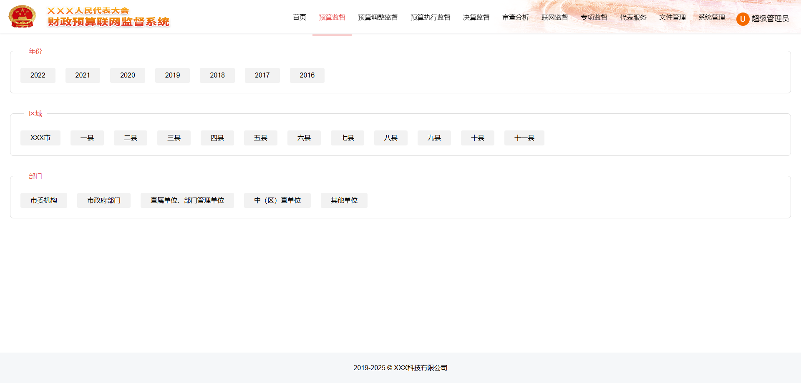

## 人大预算联网监督系统

人大财政预算联网监督是建立和完善中国特色社会主义预算审查监督制度的有益探索，是贯彻实施预算法， 加强对政府全口径预算决算审查监督，推动实施全面规范、公开透明预算制度的客观需要，是对人大预算审查监督工作的创新发展。

项目地址：[Github](https://github.com/silianpan/bss-web)、[国内Gitee](https://gitee.com/twofloor/bss-web)

演示地址：http://silianpan.cn/bss/

以下是演示角色和账号（密码同账号）：

* 超级管理员：seal_admin
* XXX市人大管理员：xxx_admin
* XXX市人大代表一：rddb1
* XXX市人大代表二：rddb2
* 一县人大管理员：1_admin
* 一县人大代表：1_rddb

项目有单体版、SaaS版（上级人大，下级人大），支持私有化部署。

**欢迎沟通交流，作者(wx:twofloor1993,qq:2480621579)**

### 部分截图

* 首页

  

* 下级人大

  

* 预算监督

  

* 预算调整监督

  

* 预算执行监督

  

* 决算监督

  

* 审查分析

  

* 联网监督

  

* 专项监督

  

* 代表服务

  

* 文件管理

  

* 系统管理

  

  

